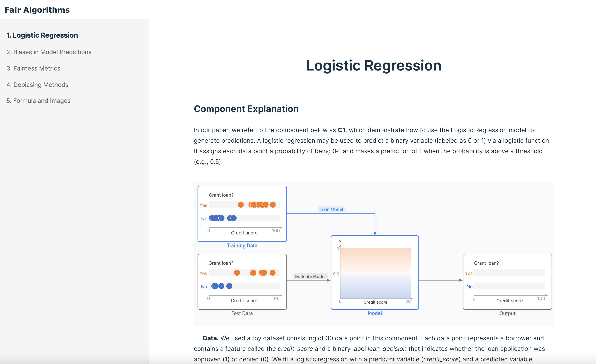
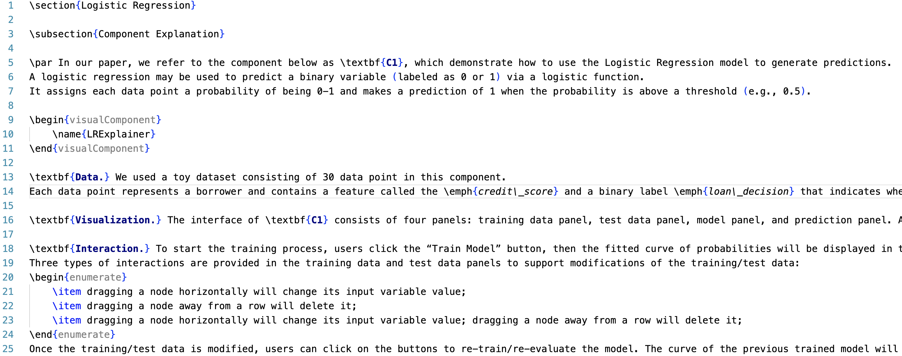
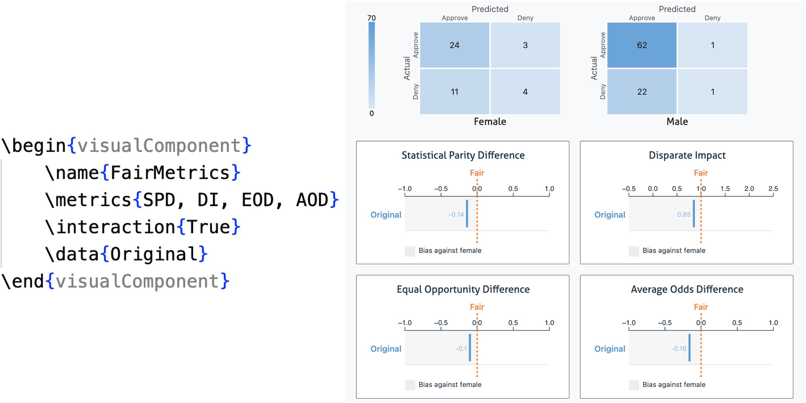
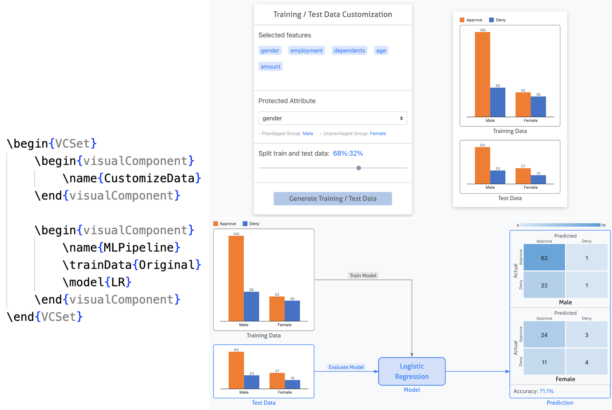

# Visual Components for AI Fairness Education

This repository presents a web-based system that is able to integrate text, images, and interactive visualizations to educate non-technical students on fairness in AI. Specifically, we demonstrate six types of interactive visualizations, which are utilized independently or collectively to illustrate logistic regression, fairness metrics, and bias mitigation methods.

Paper: [Exploring Visualization for Fairness in AI Education](https://ieeexplore.ieee.org/stamp/stamp.jsp?tp=&arnumber=10541664) PacificVIS 2024 


## Video
[](https://youtu.be/9sZiUec2BAE)


## Installation

1. Create a virtual environment 

For macOS:

```
cd FairAI-Education-VisTool
python3 -m venv .venv
. .venv/bin/activate
```

For Windows:

```
cd FairAI-Education-VisTool
python -m venv .venv
.venv\Scripts\activate
```


2. Install packages

```
pip install Flask
pip install Flask-Session
pip install Flask-Assets
pip install scikit-learn
pip install pandas
pip install 'aif360[LFR,OptimPreproc, AdversarialDebiasing, DisparateImpactRemover]'
```


3. Launch the tool

```
python3 run.py
```

After running the above commands, you can launch this tool by visiting http://127.0.0.1:8000/ on the local machine (Chrome is recommended).


## Interface 

<div style="text-align:center">

</div>


The screenshot above shows an interface after running the tool. On the left, there are five chapters, and the content of the selected chapter is displayed on the right.

Chapters 1-4 encompass all the interactive visualizations we crafted, accompanied by textual descriptions of how to interpret and interact with them. In particular, we utilized a loan example to showcase four fairness metrics, along with three pre-processing models, two in-processing models, and one post-processing model. Chapter 5 show examples demonstrating how to insert mathematical formula and images into the interface.

## LaTeX Templates

<div style="text-align:center">

</div>


Each chapter within the interface is generated from a `.tex` file containing specified commands. For example, the screenshot above displays the `.tex` file for the first chapter *Logistic Regression*. The LaTeX templates for all five chapters are put in the folder `/app/static/uploads/chapters/`. Users can modify the templates for reuse. The `.tex` files support the following format.

- **Text**: We utilize *LaTeX.js* for rendering text. Please refer to https://latex.js.org/ for a comprehensive list of supported commands.
- **Formula**: Mathematical expressions are rendered using *MathJax*. For a detailed list of supported commands, visit https://www.mathjax.org/.
- Additionally, we have implemented the functions to insert **images** and **references** into the interface. Refer to the LaTeX templates for  details.

Similarly, we designed specified LaTeX commands to render interactive components. Each interactive component is defined by the *visualComponent* scope in a Latex file with varying attributes. For example, the figure below shows the command deisgned for C4 and the C4 interface.

<div style="text-align:center">

</div>


Multiple interactive components can be combined using the *VCSet* scope. The Figure below shows an example of linking C2 and C3 together, where the training and test data used in C3 are generated from C2. We have provided all available combinations of components in the LaTeX templates.

<div style="text-align:center">

</div>
